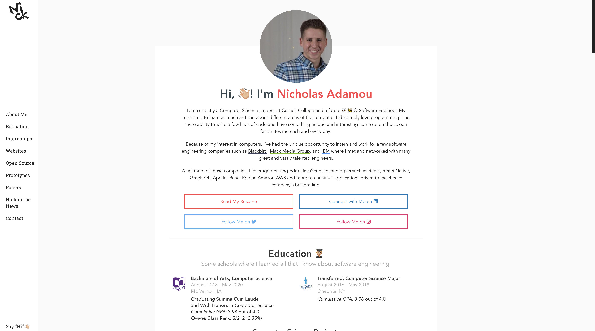

# Nicholas Adamou's Personal Website 

Personal landing page, powered by [nicholasadamou/starter-kit](https://github.com/nicholasadamou/starter-kit) ✨

## Description

After many iterations and deployments throughout many providers, I decided to
optimize my landing page and host it statically on [surge.sh](http://surge.sh).

## Development

### Requirements

-   [Node.js](https://nodejs.org/en/)
-   [Yarn](https://yarnpkg.com/en/) (recommended)

### Steps

-   Clone this repository.
-   Install dependencies using `yarn install-dependencies`.
-   Start development server by running `gulp start`.
-   Build and export using `gulp build` (creates `public` directory).

⚠️ More information about how to use this project can be found 👉 [nicholasadamou/starter-kit](https://github.com/nicholasadamou/starter-kit).

## Partners

[BrowserStack](https://www.browserstack.com/) is used as a cloud web and mobile testing platform that enables developers, like myself, to test their websites and mobile applications across on-demand browsers, operating systems and real mobile devices, without requiring users to install or maintain an internal lab of virtual machines, devices or emulators.

## License

© 2019 Nicholas Adamou.

It is free software, and may be redistributed under the terms specified in the [LICENSE] file.

[license]: LICENSE
