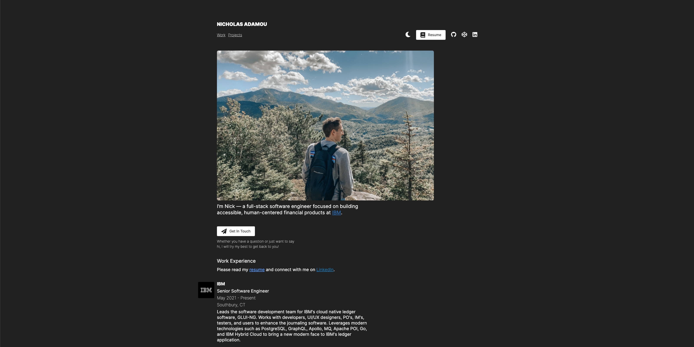

<h1 align="center">
  nicholasadamou.com - v3
</h1>
<p align="center">
  The third iteration of <a href="https://nicholasadamou.com" target="_blank">nicholasadamou.com</a> built with <a href="https://kit.svelte.dev/" target="_blank">SvelteKit</a> and hosted with <a href="https://www.netlify.com/" target="_blank">Netlify</a>.
</p>
<p align="center">
  Previous iterations:
  <a href="https://github.com/nicholasadamou/v1" target="_blank">v1</a> and
  <a href="https://github.com/nicholasadamou/v2" target="_blank">v2</a>.
</p>
<p align="center">
  <a href="https://circleci.com/gh/nicholasadamou/nicholasadamou.com" target="_blank">
    
  </a>
  <a href="https://app.netlify.com/sites/nicholasadamou/deploys" target="_blank">
    
  </a>
</p>



## 🚨 Forking this repo (please read!)

Many people have contacted me asking me if they can use this code for their own website, and the answer to that question is usually **yes, with attribution**.

I value keeping my site open source, but as you all know, _**plagiarism is bad**_. It's always disheartening whenever I find that someone has copied my site without giving me credit. I spent a non-trivial amount of effort building and designing this iteration of my website, and I am proud of it! All I ask of you all is to not claim this effort as your own.

Please also note that I did not build this site with the intention of it being a starter theme, so if you have questions about implementation, please refer to the [SvelteKit docs](https://kit.svelte.dev/docs).

Please review the [license](LICENSE), do not copy it directly, remove all of my personal information (images, projects, etc.) and change the styling and colors to match your personal brand. You are free to use this code as inspiration or learning reference but this is not a template.

### TL;DR

Yes, you can fork this repo. Please give me proper credit by linking back to [nicholasadamou.com](https://nicholasadamou.com). Thanks!

## 🛠 Installation & Set Up

### Requirements

- [Node.js](https://nodejs.org/en/)
- [pnpm](https://pnpm.io/) (recommended)

### Steps

1. Install and use the correct version of Node using [NVM](https://github.com/nvm-sh/nvm).

   ```sh
   nvm install
   ```

2. Install dependencies.

   ```sh
   pnpm install
   ```

3. Start the development server:

   ```bash
   pnpm dev

   # or start the server and open the app in a new browser tab
   pnpm dev -- --open
   ```

   Alternatively, you can execute the project along with the Netlify (λ) [functions](functions):

   ```bash
   pnpm netlify
   ```

   Learn more about the _Netlify_ CLI on their [documentation page](hhttps://www.netlify.com/docs/functions/).

## 🚀 Building and Running for Production

Before creating a production version of your app, install an [adapter](https://kit.svelte.dev/docs#adapters) for your target environment. Then:

```bash
pnpm run build
```

> You can preview the built app with `yarn preview`, regardless of whether you installed an adapter. This should _not_ be used to serve your app in production.

## 📚 The Tech. Stack

This project uses the following technologies:

**The Front-End**:

1. [**SvelteKit**](https://kit.svelte.dev/) - The fastest way to build svelte apps.
   - [**svelte-query**](https://sveltequery.vercel.app/) - Performant and powerful data synchronization for Svelte.
   - [**svelte-lazy**](https://github.com/leafOfTree/svelte-lazy) - A svelte component to lazyload any content including images.
   - [**svelte-awesome**](https://github.com/RobBrazier/svelte-awesome#more-advanced-cases) - Awesome SVG icon component for Svelte JS, built with Font Awesome icons.
   - [**svelte-loading-spinners**](https://github.com/Schum123/svelte-loading-spinners) - A collection of loading spinner components for SvelteJS.
   - [**svelte-scrollto**](https://github.com/langbamit/svelte-scrollto) - Animating vertical and horizontal scrolling.

## ⛓️ CI/CD Pipeline

This project uses the following CI/CD Pipeline:

1. [**CircleCI**](https://circleci.com/) - CircleCI is used to test whether or not this project builds successfully.
2. [**Netlify**](https://netlify.com/) - For continuous deployment to [_nicholasadamou.com_](https://nicholasadamou.com).

## Design 🎨

The design was developed using [**Figma**](https://www.figma.com/). It can be found at this [_shared link_](https://www.figma.com/file/WaCj0rJmmvUkky3StLTrG8/nicholasadamou.com-v3?node-id=0%3A1).

## License

© Nicholas Adamou.

It is free software, and may be redistributed under the terms specified in the [LICENSE] file.

[license]: LICENSE
