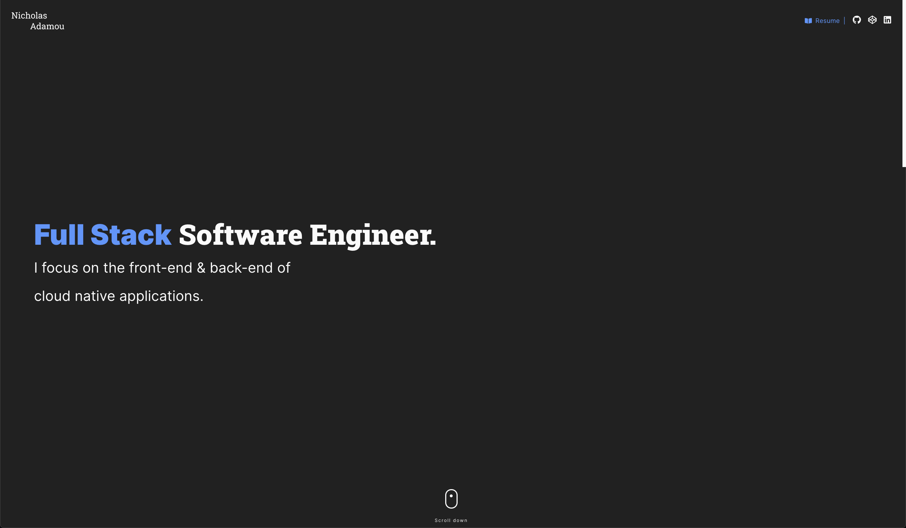

<h1 align="center">
  nicholasadamou.com - v2
</h1>
<p align="center">
  The second iteration of <a href="https://nicholasadamou.com" target="_blank">nicholasadamou.com</a> built with <a href="https://www.gatsbyjs.org/" target="_blank">Gatsby</a> and hosted with <a href="https://www.netlify.com/" target="_blank">Netlify</a>.
</p>
<p align="center">
  Previous iterations:
  <a href="https://github.com/nicholasadamou/v1" target="_blank">v1</a>
</p>
<p align="center">
  <a href="https://circleci.com/gh/nicholasadamou/nicholasadamou.com" target="_blank">
    
  </a>
  <a href="https://app.netlify.com/sites/nicholasadamou/deploys" target="_blank">
    
  </a>
</p>



## 🚨 Forking this repo (please read!)

Many people have contacted me asking me if they can use this code for their own website, and the answer to that question is usually **yes, with attribution**.

I value keeping my site open source, but as you all know, _**plagiarism is bad**_. It's always disheartening whenever I find that someone has copied my site without giving me credit. I spent a non-trivial amount of effort building and designing this iteration of my website, and I am proud of it! All I ask of you all is to not claim this effort as your own.

Please also note that I did not build this site with the intention of it being a starter theme, so if you have questions about implementation, please refer to the [Gatsby docs](https://www.gatsbyjs.org/docs/).

### TL;DR

Yes, you can fork this repo. Please give me proper credit by linking back to [nicholasadamou.com](https://nicholasadamou.com). Thanks!

## 🛠 Installation & Set Up

### Requirements

- [Node.js](https://nodejs.org/en/)
- [Yarn](https://yarnpkg.com/en/) (recommended)

### Steps

1. Install the Gatsby CLI.

   ```sh
   npm install -g gatsby-cli
   ```

2. Install and use the correct version of Node using [NVM](https://github.com/nvm-sh/nvm).

   ```sh
   nvm install
   ```

3. Install dependencies.

   ```sh
   yarn
   ```

4. Run the live-reload server on <http://localhost:8000>.

	```bash
	yarn start
	```

    If needed, you can then access the [GraphiQL](https://www.gatsbyjs.com/docs/how-to/querying-data/running-queries-with-graphiql/) interface on <http://localhost:8000/___graphql>.


## 🚀 Building and Running for Production

1. Generate a full static production build.

   ```sh
   npm run build
   ```

1. Preview the site as it will appear once deployed.

   ```sh
   npm run serve
   ```

## 📚 The Tech. Stack

This project uses the following technologies:

**The Front-End**:

- [**Gatsby**](<https://www.gatsbyjs.com/>) - Used as base React framework along with:
  - [**Styled-Components**](https://www.styled-components.com/) - for styling.
  - [**Font Awesome**](https://fontawesome.com/how-to-use/on-the-web/using-with/react) - for icons.
  - [**Carbon**](https://react.carbondesignsystem.com/?path=/story/getting-started-welcome--welcome) & [**Material UI**](https://material-ui.com/) - for loading animations.
  - [**Bulma**](https://bulma.io/) - for layout styling.
  - [**Moment.js**](https://momentjs.com/) - for handling dates.

## ⛓️ CI/CD Pipeline

This project uses the following CI/CD Pipeline:

1. [**CircleCI**](https://circleci.com/) - CircleCI is used to test whether or not this project builds successfully.
2. [**Netlify**](https://netlify.com/) - For continuous deployment to [_nicholasadamou.com_](https://nicholasadamou.com).

## License

© Nicholas Adamou.

It is free software, and may be redistributed under the terms specified in the [LICENSE] file.

[license]: LICENSE
